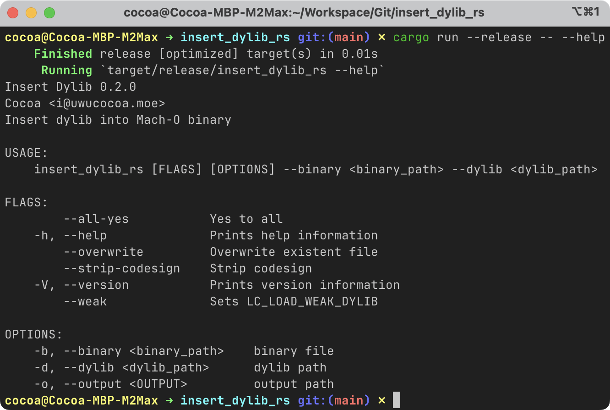

# insert_dylib_rs
Rewrite insert_dylib in Rust

### Usage

```bash
cargo build --release

# for help info
cargo run --release -- --help

# example
cargo run --release -- \
    --binary /Applications/SomeApp.app/Contents/MacOS/SomeApp \
    --dylib @rpath/libfunc.dylib \
    --weak --strip-codesign
```

Thanks for all the work from original author [Tyilo/insert_dylib](https://github.com/Tyilo/insert_dylib).

### Screenshot

